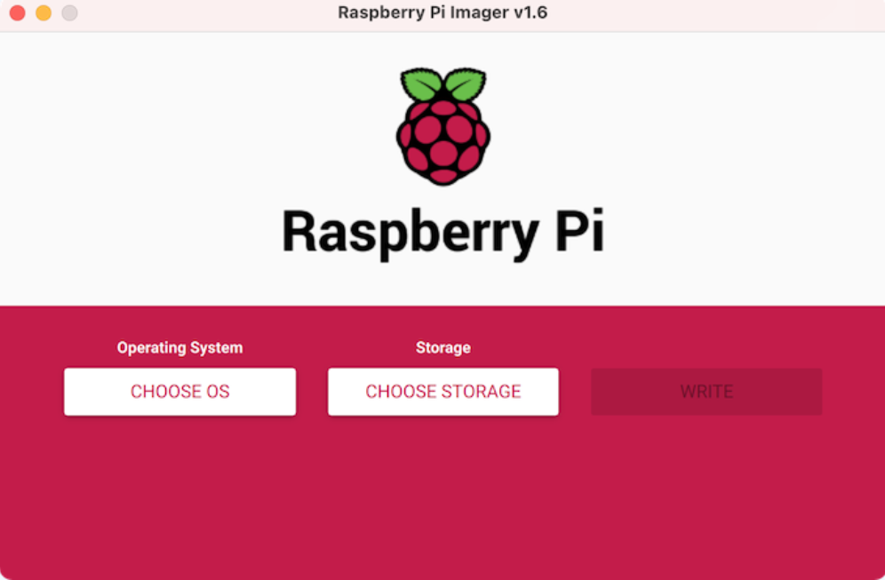

# Raspberry Pi Camera Stream

## 1) Get a raspberry pi model 4B board and a web camera


## 2) Setup an Operating system
i) Download Raspberry Pi Imager


ii) Flash your chosen operating system to the SD card (in our case we used Ubuntu 22.04)

iii) Connect a screen to your raspberry pi to setup your operating system

## 3) Setup python to your Operating system

Check if your system has python in it:

```sh
python3 --version
```
If you see a message mentioning a version above 3 you can skip installing it.

For ubuntu use the command below to install python :

```sh
sudo apt-get update
sudo apt-get install python3.6
```
## 4) Create a flask python app to stream your camera feed

i) Create a camera.py file that will contain the VideoCamera class :
```py

import cv2
from datetime import datetime

class VideoCamera(object):
    def __init__(self, flip = False, file_type  = ".jpg", photo_string= "stream_photo"):
        self.vs = cv2.VideoCapture(-1)
        self.vs.set(cv2.CAP_PROP_FRAME_WIDTH, 300)
        self.vs.set(cv2.CAP_PROP_FRAME_HEIGHT, 300)
        
        self.flip = flip # Flip frame vertically
        self.file_type = file_type # image type i.e. .jpg
        self.photo_string = photo_string # Name to save the photo

    def __del__(self):
        self.vs.release()

    def get_frame(self):
        ret, image = self.vs.read()
        if not ret:
            return
        
        ret, jpeg = cv2.imencode(self.file_type,image, [cv2.IMWRITE_JPEG_QUALITY,30])
        return jpeg.tobytes()

```

ii) Create the flaskcam.py file that contains the flask server:
```py
from flask import Flask, render_template, Response, request, send_from_directory
from camera import VideoCamera
import os
import time

pi_camera = VideoCamera(flip=False) # flip pi camera if upside down.

# App Globals (do not edit)
app = Flask(__name__)

@app.route('/')
def index():
    return render_template('index.html') #you can customze index.html here

def gen(camera):
    #get camera frame
    while True:
        time.sleep(1.5)
        frame = camera.get_frame()
        yield (b'--frame\r\n'
               b'Content-Type: image/jpeg\r\n\r\n' + frame + b'\r\n\r\n')

@app.route('/video_feed')
def video_feed():
    return Response(gen(pi_camera),
                    mimetype='multipart/x-mixed-replace; boundary=frame')

if __name__ == '__main__':
    app.run(host='0.0.0.0', debug=False)

```

iii) Create a folder called templates and create a html file called index.html with the following code 

```html

<!DOCTYPE html>
<html>

<head>
  <link rel="shortcut icon" href="{{ url_for('static', filename='favicon.ico') }}">
  <meta name="viewport" content="width=device-width, initial-scale=1">
  <style>
    body {
      padding: 0;
      width: 100vw;
      height: 100vh;
      overflow: hidden;
      background-color: black;
      margin: 0;
      font-family: Arial, Helvetica, sans-serif;
    }

    .main {
      padding: 16px;
      margin-bottom: 30px;
    }

    .camera-movement {
      float: none;
      position: absolute;
      top: 50%;
      left: 50%;
      transform: translate(-50%, -50%);
    }

    .lights-button {
      float: right;
    }

    i.fa {
      display: inline-block;
      border-radius: 60px;
      box-shadow: 0px 0px 2px #888;
      padding: 0.5em 0.6em;
    }

    img {
      display: block;
      margin-left: auto;
      margin-right: auto;
      width: 35%
    }

    .camera-bg {
      position: fixed;
      top: 0;
      left: 0;

      /* Preserve aspet ratio */
      min-width: 100%;
      min-height: 100%;

      /* Full height */
      height: 100%;


      /* Center and scale the image nicely */
      background-position: center;
      background-repeat: no-repeat;
      background-size: cover;
    }

    .top-right-logo {
      position: absolute;
      top: 3%;
      left: 2%;
      font-size: 38px;
      color: white;
      opacity: 0.5;
    }
  </style>
</head>

<title>PiStream</title>
<meta name="viewport" content="width=device-width, initial-scale=1">
<link rel="stylesheet" href="https://cdnjs.cloudflare.com/ajax/libs/font-awesome/4.7.0/css/font-awesome.min.css">

<body>

  <div class="main" id="newpost">
    

  </div>

  <div class="top-right-logo">
    <a></a>Raspberry Pi - Karakoulak Stream</a>
  </div>
</body>

</html>

```

iv) Create a folder called static and place a favicon.ico file in it for the sites logo.


## 5) Get a domain name 

In our case we used duckdns.org to get a free domain name.

## 6) Setup a linux vps with static IP 

We used Linode for this step, you can get a free trial on Linode to test things.

Remember to open a port if your VPS has a firewall to access it from the web.

This step is used in order to be able to stream our camera feed on the internet!

## 7) Setup frp connection

frp is a fast reverse proxy to help you expose a local server behind a NAT or firewall to the Internet.

Download frp for your operating system's architecture from [here](https://github.com/fatedier/frp/releases).

Follow the instructions as presented in their github Read.md for your use case.

In our case we did: 
### On server side
i) Modify `frps.ini`, set the vhost HTTP port to 8080:

  ```ini
  # frps.ini
  [common]
  bind_port = 7000
  vhost_http_port = 8080
  ```

ii) Start `frps`:

  `./frps -c ./frps.ini`

### On local machine side

iii) Modify `frpc.ini` and set `server_addr` to the IP address of the remote frps server. The `local_port` is the port of your web service:

  ```ini
  # frpc.ini
  [common]
  server_addr = x.x.x.x
  server_port = 7000

  [web]
  type = http
  local_port = 80
  custom_domains = www.example.com
  ```

iv) Start `frpc`:

  `./frpc -c ./frpc.ini`

v) Resolve A record of `www.example.com` to the public IP of the remote frps server or CNAME record to your origin domain.

In our case we just insert the public IP address of the VPS to duckdns.org to point to it.

vi) Now visit your local web service using url `http://www.example.com:8080`.


